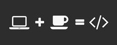

<h1 align="center"> Hi there, my name is Zsófi! 👋</h1>

(Sophie is the English version of Zsófi so feel free to call me that.)

 

<h3 align="center">In july of 2019 I enrolled in a one-year course at Codecool, Hungary and that was the first time I experienced the fun and challenges of being a programmer.</h3>
<h3 align="center"> 🌱 I studied several technologies and languages on both frontend and backend side. I am eager to learn and I like to work with any of them.</h3>

 
<h3 align="center">🔭 I learned a little bit of Angular on my own, using online tutorial videos and a course from <a href="https://www.codewithmosh.com">Code with Mosh</a> website and the little I got to know, I loved.</h3>

  

<h3> 🌱 I have started to work full-time at a company so I am sorry if many of my repos are not finished.</h3>
<h3 align="center">📫 Check out my LinkedIn profile:</h3>

  

<h4 align="center">⚡ Fun fact: I studied English Studies and Liberal Arts at a university but I quit both of them and started to focus on programming</h4>

  

<h3 align="center">Have fun checking out my repositories! 👋 </h3>

  

